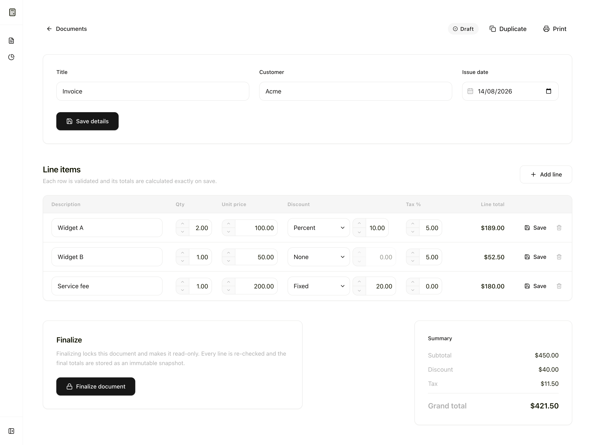
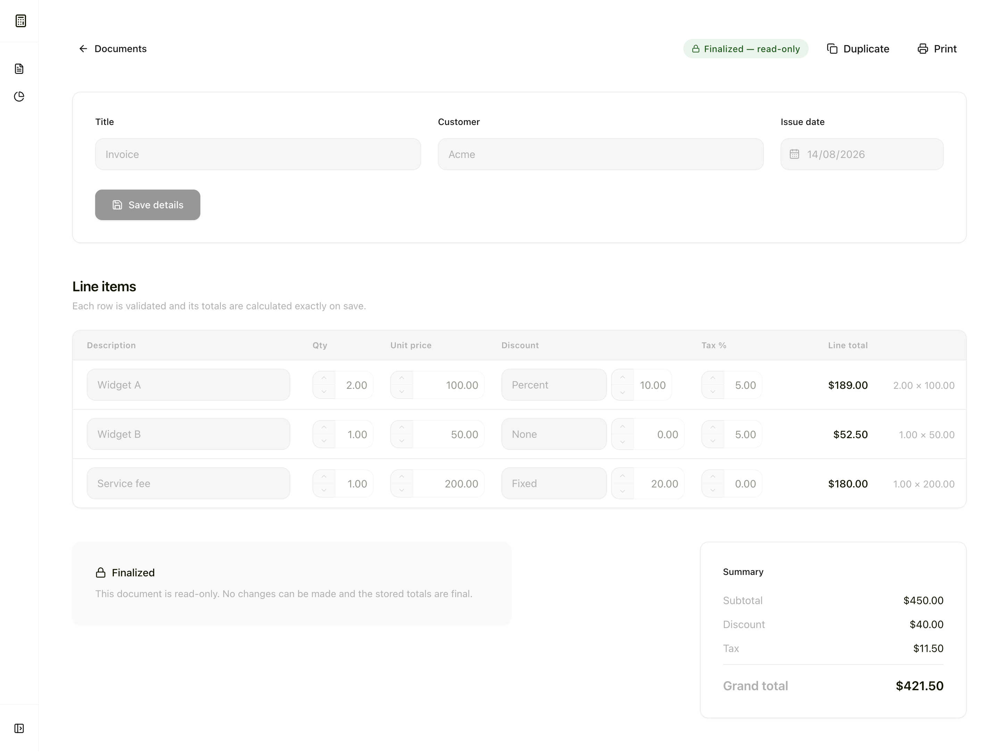
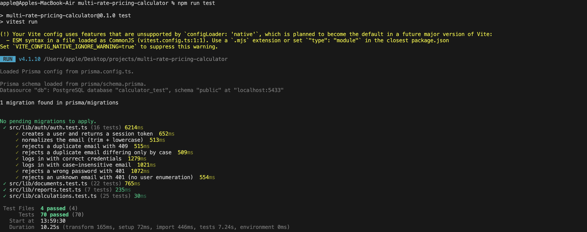

# QuoteCalc

CrossVal Multi-Rate Pricing Calculator take-home submission.

- **Live:** https://quotecalc-aminah.vercel.app
- **Stack:** Next.js 16 (App Router + Route Handlers) · TypeScript · Prisma 7 · PostgreSQL · decimal.js · Vitest

## Contents

1. [Running locally](#running-locally)
2. [Calculation & rounding policy](#calculation--rounding-policy)
3. [Finalize / immutability rules](#finalize--immutability-rules)
4. [What was tested](#what-was-tested)
5. [Architecture & data flow](#architecture--data-flow)
6. [Assumptions & tradeoffs](#assumptions--tradeoffs)
7. [What I would improve before production](#what-i-would-improve-before-production)

## Running locally

Prerequisites: Node.js 20+, npm.

1. **Install dependencies**

   ```bash
   npm install          # runs prisma generate
   ```

2. **Create your local env**

   ```bash
   cp .env.example .env
   ```

3. **Set the session secret** — any random string is fine:

   ```bash
   openssl rand -base64 32    # paste the output into AUTH_SECRET in .env
   ```

4. **Provide a Postgres database** — either option works:

   - **Local Postgres with Docker:** run `docker compose up -d`. The `.env.example` `DATABASE_URL`/`TEST_DATABASE_URL` already point at these ports (app `5432`, tests `5433`).
   - **Remote Postgres (e.g. Neon):** create a project, copy its pooled connection string, and set it as `DATABASE_URL` in `.env`:

     ```bash
     # .env
     DATABASE_URL="postgresql://<user>:<password>@<host>/<db>?sslmode=require"
     ```

5. **Apply the schema migrations**

   ```bash
   npm run db:migrate
   ```

   This targets whichever database `DATABASE_URL` points at (Docker or remote).

6. **Start the app**

   ```bash
   npm run dev          # open http://localhost:3000
   ```

Tests, typecheck, lint:

```bash
npm test                         # 70 tests (Vitest)
npx tsc --noEmit
npm run lint
```

## Calculation & rounding policy

All monetary calculations are performed server-side using decimal.js to avoid floating-point errors.

The calculation order for each line is:

1. `subtotal = quantity × unit price`
2. Apply either a percentage or fixed discount.
3. Calculate tax on the amount after discount.
4. `line total = discounted amount + tax`

Monetary values are rounded to 2 decimal places using `ROUND_HALF_UP` at the line level. Document totals are calculated by summing the rounded values from each line.

A line can have a percentage discount, a fixed discount, or no discount. A fixed discount greater than the line subtotal is rejected with a validation error rather than silently clamped.

The server is the source of truth for all calculated amounts. The client submits the line inputs but does not provide authoritative subtotal, discount, tax, or grand-total values.

### Worked example

Using the assignment sample:

**Widget A: 2 × 100.00, 10% discount, 5% tax**

```text
Subtotal         = 2 × 100.00
                 = 200.00

Discount         = 200.00 × 10%
                 = 20.00

After discount   = 200.00 - 20.00
                 = 180.00

Tax              = 180.00 × 5%
                 = 9.00

Line total       = 180.00 + 9.00
                 = 189.00
```

**Widget B: 1 × 50.00, no discount, 5% tax**

```text
Subtotal         = 1 × 50.00
                 = 50.00

Discount         = 0.00

After discount   = 50.00

Tax              = 50.00 × 5%
                 = 2.50

Line total       = 50.00 + 2.50
                 = 52.50
```

**Service fee: 1 × 200.00, 20.00 fixed discount, no tax**

```text
Subtotal         = 1 × 200.00
                 = 200.00

Discount         = 20.00

After discount   = 200.00 - 20.00
                 = 180.00

Tax              = 0.00

Line total       = 180.00
```

**Document totals**

```text
Subtotal         = 200.00 + 50.00 + 200.00
                 = 450.00

Total discount   = 20.00 + 0.00 + 20.00
                 = 40.00

Total tax        = 9.00 + 2.50 + 0.00
                 = 11.50

Grand total      = 189.00 + 52.50 + 180.00
                 = 421.50
```

### Verified in the app



The same sample is covered by automated tests at the calculation and document-service levels.

## Finalize / immutability rules

Documents have two states:

- **Draft:** Fully editable. Users can update document details, add/edit/remove line items, or delete the document.
- **Finalized:** Immutable. Document details and line items can no longer be changed, and the document cannot be deleted.

Immutability is enforced server-side. Attempts to update or delete a finalized document are rejected with **HTTP 409**, even if the request bypasses the UI.

When a document is finalized, the server:

1. Verifies that it contains at least one line item.
2. Revalidates every line item.
3. Recalculates all line and document totals from the original inputs.
4. Saves the calculated totals and changes the status to `FINALIZED` in a single database transaction.

This ensures a finalized document represents a consistent financial snapshot rather than simply a disabled editing screen.

### Duplication

I implemented the optional duplication flow for both draft and finalized documents. Duplicating creates a new `DRAFT` document from the original line inputs and recalculates its totals using the same calculation rules.

### Finalized state in the app



The UI reflects the finalized state by removing/disabling editing actions. The same restriction is enforced independently by the API and covered by lifecycle tests.

## What was tested

The test suite contains **70 automated tests** focused on the parts where incorrect behavior would matter most: calculations, document lifecycle, user isolation, reporting, and authentication.

### Calculations

- The exact assignment sample produces `450.00` subtotal, `40.00` discount, `11.50` tax, and `421.50` grand total.
- Percentage and fixed discounts, including tax being applied after discount.
- `ROUND_HALF_UP` behavior and fractional-cent edge cases.
- Zero-value and 100% discount cases.
- Rejection of invalid quantities, prices, percentages, discount types, and fixed discounts above the line subtotal.
- Repeated calculations do not introduce floating-point drift.

### Document lifecycle

- Finalized documents reject changes to metadata and line items, as well as deletion.
- Finalization revalidates line items and recalculates totals.
- Empty documents cannot be finalized.
- Adding, updating, or removing lines from drafts recalculates document totals.
- Duplicating either a draft or finalized document creates a new draft with recalculated totals.
- Calculated totals remain server-controlled rather than being accepted from client input.

### User isolation & authentication

- Users cannot read or modify another user's documents.
- Registration handles normalized/duplicate emails correctly.
- Invalid credentials and tampered sessions are rejected.
- User deletion cascades to owned documents and line items.

### Reporting

- Date-range boundaries are inclusive.
- Document count, grand total, tax, and discount aggregates match the underlying documents.
- Empty ranges return zero totals.
- Invalid date ranges are rejected.

### Run the tests

```bash
npm test
```

All automated tests passing.



## Architecture & data flow

The application keeps financial rules on the server. The browser submits document and line-item inputs and renders the calculated values returned by the API.

```text
┌─────────────────────────────┐
│         React UI            │
│                             │
│ Document + line-item inputs │
│ Displays server totals      │
└──────────────┬──────────────┘
               │
               │ authenticated requests
               ▼
┌─────────────────────────────┐
│   Next.js Route Handlers    │
│                             │
│ Authentication              │
│ User ownership              │
│ Request validation          │
│ Draft/finalized enforcement │
└──────────────┬──────────────┘
               │
               ▼
┌─────────────────────────────┐
│   Document Business Logic   │
│                             │
│ Create / update lines       │
│ Finalize / duplicate        │
│ Recalculate document        │
│ Build report aggregates     │
└──────────┬───────────┬──────┘
           │           │
           │           │
           ▼           │
┌────────────────────┐ │
│ Pricing Calculator │ │
│                    │ │
│ subtotal           │ │
│ → discount         │ │
│ → tax              │ │
│ → rounding         │ │
│ → totals           │ │
└─────────┬──────────┘ │
          │            │
          └──────┬─────┘
                 ▼
┌─────────────────────────────┐
│    Prisma + PostgreSQL      │
│                             │
│ Users / ownership           │
│ Documents + line items      │
│ Calculated totals           │
└──────────────┬──────────────┘
               │
               │ server-calculated result
               ▼
          React UI
```

`src/lib/calculations.ts` is the shared calculation path used when line items change and when documents are finalized or duplicated. Reports aggregate the persisted document totals — they do not recompute them. The UI does not supply authoritative totals.

## Assumptions & tradeoffs

- **Fixed discount above subtotal.**
  I reject the input rather than clamp it. This requires the user to correct the value, but avoids silently changing a financial input.

- **Rounding.**
  Amounts are rounded to 2 decimal places using `ROUND_HALF_UP` at the line level, then document totals are summed from those rounded values. Rounding only at the document level would preserve more intermediate precision, but line-level rounding ensures displayed lines add up to the displayed totals.

- **Fractional quantities.**
  Quantity is defined as a number ≥ 1, with no integer requirement, so fractional values such as `2.5` are allowed. This supports cases such as hourly or unit-based billing.

- **Deleting finalized documents.**
  Finalized documents cannot be deleted. This is more restrictive than allowing deletion, but prevents finalized records and historical report totals from disappearing.

- **Duplication.**
  Draft and finalized documents can be duplicated into a new draft. This adds another lifecycle path, but lets users reuse an existing document without modifying the original finalized record.

## What I would improve before production

My first priorities would be:

1. **Concurrent editing protection**
   Draft updates are currently last-write-wins. I would add optimistic concurrency using a document version or `updatedAt` check so stale updates can be detected instead of silently overwriting newer changes.

2. **Audit history**
   Record document creation, edits, finalization, and the user responsible for each action. This would provide a history of changes around financial records.

3. **Authentication hardening**
   Add rate limiting, account recovery/email verification, and stronger session management before exposing the application to real users.

4. **CI and observability**
   Run linting, type checking, and tests automatically on pull requests/deployments, and add structured application logging and error monitoring.
